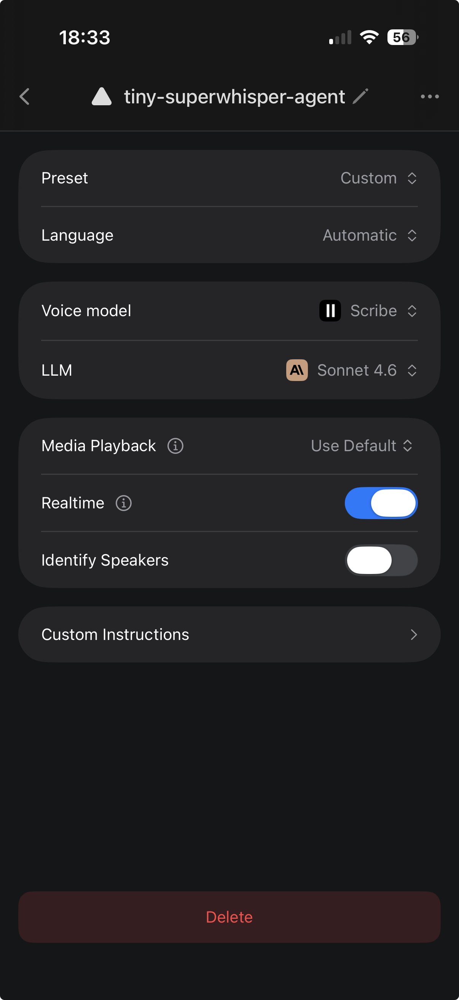

<h1>
  
  tiny-superwhisper-agent
</h1>

An Apple Shortcut that turns Superwhisper into a tiny agent for routing dictation to clipboard, text post-processing, TickTick, Notion, and more.

## What It Does

Superwhisper returns a JSON object, and the shortcut routes it into one of four actions:

- `passthrough`: clean dictation and copy it to the clipboard
- `processed`: run AI post-processing and copy the result to the clipboard
- `add_task`: create a TickTick task with smart date/time formatting
- `add_notion_page`: create a Notion page with summary, details, and transcript

## Setup In 3 Steps

Install and sign in to Superwhisper first. TickTick and Notion are needed only for their respective actions.

1. **Create the Superwhisper custom mode**

   Create a custom mode named exactly `tiny-superwhisper-agent`, then paste the prompt from [`superwhisper-custom-prompt.md`](superwhisper-custom-prompt.md).

   Use settings like these:

   

   (Sonnet 4.6 worked well for me, but may be overkill. Use any voice/LLM model you prefer.)

2. **Install the Apple Shortcut**

   Download [`tiny-superwhisper-agent.shortcut`](tiny-superwhisper-agent.shortcut) and open it with the Apple Shortcuts app on iPhone.

   The first Superwhisper action is already configured to call the custom mode named `tiny-superwhisper-agent`.

   If your iPhone has an Action Button, map it to this shortcut. Press once to start talking to the agent, then press again to stop and run the action.

3. **Configure TickTick and Notion**

   Open the shortcut in Apple Shortcuts and select your own:

   - TickTick list/project
   - Notion workspace/database

## Extending It

This is a router pattern. To add more actions, add a new JSON `type` to the Superwhisper prompt and a matching `If` branch in Shortcuts.

Examples: append to Apple Notes, send a Slack message, create a calendar event, save to a file, call a webhook, or trigger a home automation.

## License

MIT
